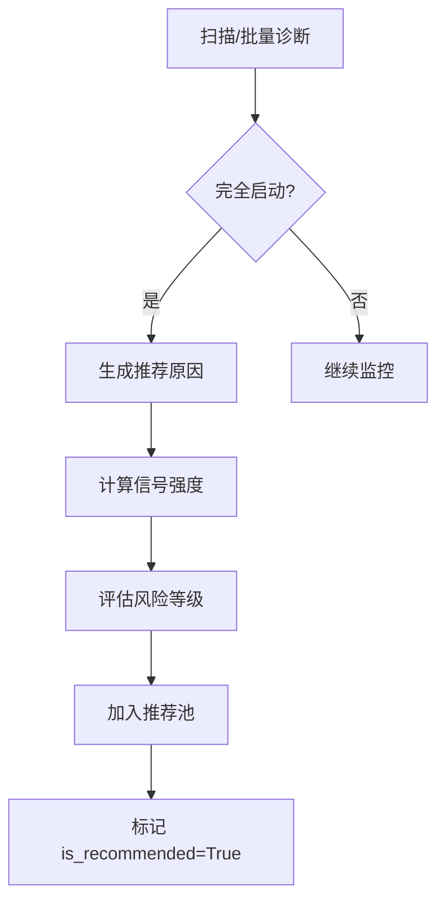

# 推荐股票池功能使用指南

## 📖 功能概述

推荐股票池功能会自动将**完全启动**的股票（通过所有四层筛选）加入推荐池，并生成详细的推荐原因。

## 🎯 筛选流程

```
基础条件 + 金叉 → 🟡 金叉候选（20分）
           ↓
      核心条件全满足 → 🟢 启动确认（40分）
           ↓
      辅助确认≥1个 → 继续加分
           ↓
      风险排除全通过 → ✅ 完全启动（60-100分）
           ↓
      【自动加入】 → 💎 推荐股票池
```

## 🗄️ 数据库部署

### 1. 执行迁移脚本

```bash
psql -h your_host -U your_user -d your_database -f migrations/add_recommendation_pool.sql
```

或使用 pgAdmin / DBeaver 执行 `migrations/add_recommendation_pool.sql` 文件。

### 2. 验证表创建

```sql
-- 查看推荐表
SELECT * FROM fact_recommended_stocks LIMIT 0;

-- 查看启动候选表新增字段
\d fact_stock_startup_candidate
```

## 🚀 使用方式

### 方式1：自动触发（推荐）

在执行以下操作时，系统会**自动**将完全启动的股票加入推荐池：

1. **扫描新股票**：点击"🔍 扫描新股票"按钮
2. **批量诊断**：点击"批量诊断"按钮

执行后会显示：
```
✅ 扫描完成！
...
推荐池新增: 3 只
```

### 方式2：手动刷新

调用API手动刷新推荐池：

```bash
# 刷新所有未推荐的完全启动股票
curl -X POST http://localhost:8000/api/recommendations/refresh

# 刷新指定日期的股票
curl -X POST "http://localhost:8000/api/recommendations/refresh?trade_date=2025-12-04"
```

## 📊 API接口

### 1. 获取推荐列表

```bash
GET /api/recommendations?days=30&min_score=60
```

**参数**：
- `days`: 查询最近N天（默认30）
- `status`: 状态筛选（active/closed/stopped）
- `min_score`: 最低得分（默认60）
- `signal_strength`: 信号强度（强/中/弱）

**返回示例**：
```json
{
  "success": true,
  "count": 5,
  "data": [
    {
      "id": 1,
      "ts_code": "000001.SZ",
      "name": "平安银行",
      "recommend_date": "2025-12-04",
      "entry_price": 15.50,
      "current_price": 16.20,
      "gain": 4.52,
      "recommend_reason": "**强烈推荐**（启动得分：95分）\n\n1. ✅ **短期均线金叉**，启动信号明确...",
      "recommend_tags": ["启动信号", "强势股", "突破新高", "放量突破"],
      "startup_score": 95,
      "signal_strength": "强",
      "risk_level": "低",
      "status": "active"
    }
  ]
}
```

### 2. 获取推荐详情

```bash
GET /api/recommendations/{id}
```

### 3. 刷新推荐

```bash
POST /api/recommendations/refresh?trade_date=2025-12-04
```

### 4. 关闭推荐

```bash
POST /api/recommendations/{id}/close
```

### 5. 获取统计

```bash
GET /api/recommendations/stats/summary?days=30
```

## 📝 推荐原因示例

### 强势突破型（90+分）

```
**强烈推荐**（启动得分：95分）

1. ✅ **短期均线金叉**，启动信号明确
2. 📈 MACD金叉，动能转强
3. 📊 KDJ(65)处于强势区间
4. 📐 均线呈多头排列，趋势向上
5. 💰 成交额12.5亿（量比2.3x），放量明显
6. 🎯 突破60日高点，强势创新高
```

### 稳健启动型（80-89分）

```
**推荐**（启动得分：85分）

1. ✅ **短期均线金叉**，启动信号明确
2. 📊 KDJ(58)处于强势区间
3. 📐 均线呈多头排列，趋势向上
4. 💰 成交额8.2亿，资金活跃
5. 🎯 距60日高点1.5%，接近突破
```

### 关注型（60-79分）

```
**关注**（启动得分：65分）

1. ✅ 满足启动条件
2. 📈 MACD金叉，动能转强
3. 💰 成交额8.2亿（量比1.6x），放量明显

⚠️ 风险提示：短期涨幅较大，注意回调风险
```

## 🏷️ 推荐标签说明

| 标签 | 说明 |
|------|------|
| 启动信号 | 基础标签（必有） |
| 强势股 | 得分≥90 |
| 优质股 | 得分80-89 |
| 突破新高 | 突破60日高点 |
| 放量突破 | 量能放大≥1.5倍 |
| 多头趋势 | 均线多头排列 |
| MACD金叉 | MACD金叉信号 |
| KDJ强势 | KDJ在60-80区间 |
| 大资金 | 成交额≥10亿 |

## ⚠️ 风险等级

- **低**：无明显风险，适合关注
- **中**：存在回调风险，建议分批买入
- **高**：风险较大，谨慎操作

## 🔄 工作流程



## 📱 前端集成（待开发）

推荐在前端添加"💎 推荐池"Tab，显示：

- 推荐日期
- 股票代码/名称
- 信号强度
- 得分
- 推荐标签
- 入选价/当前价/涨幅
- 推荐原因（可展开查看）
- 操作按钮（加入持仓/关闭推荐）

## 🔧 后续优化建议

1. **实时更新价格**：定时更新 `current_price`，计算实时涨幅
2. **止盈止损**：自动计算并设置止盈止损价
3. **追踪最大涨幅**：记录 `max_gain` 和 `max_drawdown`
4. **推荐评级**：根据后续表现评估推荐准确率
5. **邮件/微信提醒**：新推荐产生时发送通知

## 📞 测试步骤

1. **执行数据库迁移**
   ```bash
   psql -f migrations/add_recommendation_pool.sql
   ```

2. **重启后端服务**
   ```bash
   python backend/app.py
   ```

3. **触发推荐生成**
   - 方式A：前端点击"扫描新股票"
   - 方式B：前端点击"批量诊断"
   - 方式C：调用API `POST /api/recommendations/refresh`

4. **查看推荐结果**
   ```bash
   curl http://localhost:8000/api/recommendations?days=10
   ```

5. **验证数据库**
   ```sql
   SELECT 
       ts_code,
       recommend_date,
       startup_score,
       signal_strength,
       LEFT(recommend_reason, 50) as reason_preview
   FROM fact_recommended_stocks
   ORDER BY recommend_date DESC
   LIMIT 10;
   ```

## ✅ 完成标志

- [x] 数据库表创建
- [x] ORM模型定义
- [x] 推荐原因生成器
- [x] 推荐服务类
- [x] API接口
- [x] 集成到扫描和批量诊断
- [ ] 前端页面展示（待开发）
- [ ] 实时价格更新（待开发）
- [ ] 推荐统计和评级（待开发）

