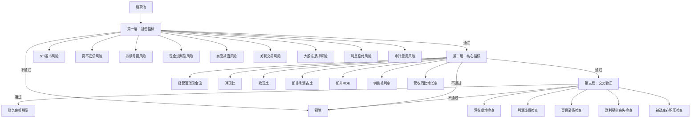

# 财务筛选规则改进方案

## 一、改进目标

基于量化分析师的深度分析，针对 `docs/wf.md` 中的财务筛选规则，提出以下11个核心改进目标：

1. **时间连续性验证**：实现连续3-5期达标检查，避免单期指标失真
2. **行业分位数对标**：所有指标对标行业内分位数（中位数/75分位），替代固定阈值
3. **完整排雷指标**：实现9项排雷指标（ST/退市、资不抵债、持续亏损、现金流断裂、商誉减值、关联交易、大股东质押、利息偿付、审计意见）
4. **核心指标检查完整性**：实现7项核心指标（净现比、收现比、扣非利润占比、扣非ROE、毛利率、营收同比、净利润同比）
5. **交叉验证规则**：实现5项交叉验证规则，避免单一指标失真
6. **盈利质量历史趋势**：检查3-5年净利润趋势和毛利率稳定性
7. **行业地位判断**：基于市值排名前30%和行业周期判断
8. **估值合理性判断**：使用5年历史分位数，替代硬编码阈值
9. **数据清洗和异常处理**：处理NaN、无限大、0值等异常值
10. **次新股过滤**：剔除上市不足1年的公司（财务数据不完整）
11. **架构优化**：分层设计，提高可维护性和扩展性

---

## 二、时间连续性验证方案

### 2.1 问题说明

**当前问题**：`darwin_long_term.py` 只检查单期财务数据，无法反映持续财务质量。单期指标达标可能是偶然，连续3-5期达标才是财务良好的核心。

**影响**：
- 无法识别财务指标的持续性和稳定性
- 可能误选单期表现好但长期不稳定的公司
- 不符合 `wf.md` 中"连续3-5期达标"的要求

### 2.2 解决方案

**核心思路**：获取连续3-5期财务数据（季度/年度），验证指标连续达标性。

**实现方法**：
1. 使用Tushare接口获取多期财务数据：
   - `fina_indicator`：财务指标（ROE、毛利率、净利率等）
   - `income`：利润表（营收、净利润、扣非净利润等）
   - `cashflow`：现金流量表（经营现金流、投资现金流等）
2. 按报告期排序，取最近N期（默认3期季度数据或5期年度数据）
3. 验证每项指标是否连续N期达标

### 2.3 代码实现示例

```python
def _get_multi_period_financial_data(
    self, 
    ts_code: str, 
    periods: int = 3,
    freq: str = 'Q'  # 'Q'季度 或 'Y'年度
) -> Optional[pd.DataFrame]:
    """
    获取连续多期财务数据（季度/年度）
    用于验证指标的连续性
    
    Args:
        ts_code: 股票代码（Tushare格式）
        periods: 需要获取的期数（默认3期）
        freq: 频率，'Q'季度或'Y'年度
    
    Returns:
        DataFrame: 按报告期倒序排列的财务数据
    """
    try:
        from backend.services.tushare_service import TushareService
        tushare_service = TushareService()
        
        if not tushare_service.available:
            return None
        
        # 计算日期范围（最近N期）
        from datetime import datetime, timedelta
        end_date = datetime.now().strftime('%Y%m%d')
        
        if freq == 'Q':
            # 季度数据：往前推N*3个月
            start_date = (datetime.now() - timedelta(days=periods*90)).strftime('%Y%m%d')
        else:
            # 年度数据：往前推N年
            start_date = (datetime.now() - timedelta(days=periods*365)).strftime('%Y%m%d')
        
        # 获取财务指标
        fina_df = tushare_service.pro.fina_indicator(
            ts_code=ts_code,
            start_date=start_date,
            end_date=end_date,
            fields='ts_code,end_date,roe,grossprofit_margin,netprofit_margin,debt_to_assets'
        )
        
        # 获取利润表
        profit_df = tushare_service.pro.income(
            ts_code=ts_code,
            start_date=start_date,
            end_date=end_date,
            fields='ts_code,end_date,revenue,net_profit,n_income_attr_p'
        )
        
        # 获取现金流量表
        cashflow_df = tushare_service.pro.cashflow(
            ts_code=ts_code,
            start_date=start_date,
            end_date=end_date,
            fields='ts_code,end_date,ocf'
        )
        
        # 合并数据
        df = pd.merge(fina_df, profit_df, on=['ts_code', 'end_date'], how='outer')
        df = pd.merge(df, cashflow_df, on=['ts_code', 'end_date'], how='outer')
        
        # 按报告期倒序排序，取最近N期
        df = df.sort_values('end_date', ascending=False).head(periods)
        
        return df
        
    except Exception as e:
        logger.error(f"获取多期财务数据失败 {ts_code}: {e}", exc_info=True)
        return None

def _check_continuous_compliance(
    self,
    df: pd.DataFrame,
    indicator: str,
    threshold: float,
    periods: int = 3,
    comparison: str = '>='  # '>=' 或 '<='
) -> bool:
    """
    检查指标是否连续N期达标
    
    Args:
        df: 多期财务数据DataFrame
        indicator: 指标名称（如'roe', 'ocf'）
        threshold: 阈值
        periods: 需要连续达标的期数
        comparison: 比较运算符（'>=' 或 '<='）
    
    Returns:
        bool: 是否连续N期达标
    """
    if df is None or len(df) < periods:
        return False
    
    recent_periods = df.head(periods)
    
    if indicator not in recent_periods.columns:
        return False
    
    if comparison == '>=':
        return (recent_periods[indicator] >= threshold).all()
    else:
        return (recent_periods[indicator] <= threshold).all()
```

### 2.4 注意事项

- **数据不足处理**：如果数据不足N期，应剔除该股票（财务数据不完整）
- **报告期对齐**：确保季度/年度数据对齐，避免混用
- **异常值处理**：在检查连续性前，先清洗异常值（NaN、无限大等）

---

## 三、行业分位数对标方案

### 3.1 问题说明

**当前问题**：`darwin_long_term.py` 使用固定阈值（如ROE≥12%），跨行业比较失真。重资产行业资产负债率60%是合理，轻资产行业60%就是高杠杆。

**影响**：
- 误杀行业内优质公司（如科技行业ROE普遍较低）
- 漏筛行业内较差公司（如消费行业ROE普遍较高）
- 不符合 `wf.md` 中"所有指标均需对标申万一级/二级行业的中位数/75分位"的要求

### 3.2 解决方案

**核心思路**：所有指标对标行业内分位数（中位数/75分位），而非全行业固定值。

**实现方法**：
1. 获取行业所有股票列表（申万一级/二级行业）
2. 批量获取财务指标（使用Tushare批量接口）
3. 计算行业分位数（中位数、75分位）
4. 使用分位数作为阈值

### 3.3 代码实现示例

```python
def _get_industry_percentile(
    self,
    industry_name: str,
    indicator: str,
    percentile: float = 0.5,  # 0.5=中位数, 0.75=75分位
    industry_level: str = 'L1'  # 'L1'一级行业, 'L2'二级行业
) -> float:
    """
    获取行业内指标的分位数阈值
    
    Args:
        industry_name: 行业名称（如"医药生物"、"计算机"）
        indicator: 指标名称（如'roe', 'grossprofit_margin'）
        percentile: 分位数（0.5=中位数, 0.75=75分位）
        industry_level: 行业级别（'L1'一级, 'L2'二级）
    
    Returns:
        float: 行业分位数阈值
    """
    try:
        from backend.services.tushare_service import TushareService
        tushare_service = TushareService()
        
        if not tushare_service.available:
            # 降级到默认阈值
            return self._get_default_threshold(indicator)
        
        # 1. 获取行业所有股票列表
        stock_basic = tushare_service.pro.stock_basic(
            exchange='',
            list_status='L',
            fields='ts_code,symbol,name,industry'
        )
        
        # 筛选行业股票
        if industry_level == 'L1':
            # 申万一级行业
            industry_stocks = stock_basic[stock_basic['industry'] == industry_name]['ts_code'].tolist()
        else:
            # 申万二级行业（需要从sw_industry表获取）
            # 简化处理：使用一级行业
            industry_stocks = stock_basic[stock_basic['industry'] == industry_name]['ts_code'].tolist()
        
        if not industry_stocks:
            logger.warning(f"未找到行业股票: {industry_name}")
            return self._get_default_threshold(indicator)
        
        # 2. 批量获取财务指标（限制数量，避免请求过多）
        max_stocks = 200  # 限制最多200只股票
        industry_stocks = industry_stocks[:max_stocks]
        
        indicator_values = []
        for ts_code in industry_stocks:
            try:
                # 获取最新一期财务指标
                fina_df = tushare_service.pro.fina_indicator(
                    ts_code=ts_code,
                    period='',
                    fields=f'ts_code,end_date,{indicator}'
                )
                
                if fina_df is not None and not fina_df.empty:
                    value = fina_df.iloc[0][indicator]
                    if pd.notna(value) and not np.isinf(value):
                        indicator_values.append(float(value))
                
                # 限速，避免请求过快
                import time
                time.sleep(0.1)
                
            except Exception as e:
                logger.debug(f"获取财务指标失败 {ts_code}: {e}")
                continue
        
        if not indicator_values:
            return self._get_default_threshold(indicator)
        
        # 3. 计算分位数
        import numpy as np
        percentile_value = np.percentile(indicator_values, percentile * 100)
        
        logger.debug(f"行业 {industry_name} 指标 {indicator} {percentile*100}分位: {percentile_value:.2f}")
        
        return float(percentile_value)
        
    except Exception as e:
        logger.error(f"计算行业分位数失败: {e}", exc_info=True)
        return self._get_default_threshold(indicator)

def _get_default_threshold(self, indicator: str) -> float:
    """获取默认阈值（当行业分位数计算失败时使用）"""
    defaults = {
        'roe': 12.0,
        'grossprofit_margin': 20.0,
        'netprofit_margin': 5.0,
        'debt_to_assets': 0.6,
    }
    return defaults.get(indicator, 0.0)
```

### 3.4 注意事项

- **金融行业特殊处理**：金融行业（银行、保险、证券）的财务指标计算方式不同，需要单独处理
- **次新股排除**：计算行业分位数时，应排除上市不足1年的次新股
- **缓存策略**：行业分位数计算结果可缓存（如1天），减少重复计算
- **性能优化**：批量获取数据，避免单只股票循环请求

---

## 四、排雷指标完整性

### 4.1 当前实现状态

**已实现**（5项）：
1. ✅ ROE检查（≥12%）
2. ✅ 现金流检查（>0）
3. ✅ 负债率检查（20%-70%区间）
4. ✅ 持续亏损风险（部分实现）
5. ✅ 利息偿付风险（部分实现）

**未实现**（4项）：
1. ❌ 商誉减值风险（商誉/净资产>30%）
2. ❌ 关联交易风险（关联交易/营收>20%）
3. ❌ 大股东质押风险（质押率>60%）
4. ❌ 审计意见风险（非标准无保留意见）

### 4.2 完整排雷指标清单

根据 `wf.md` 要求，需要实现以下9项排雷指标（一票否决）：

| 排雷指标 | 计算公式 | 阈值 | 数据来源 | 状态 |
|---------|---------|------|---------|------|
| ST/退市风险 | 财报标注 | 含ST/*ST/退市预警 | Tushare `stock_basic.list_status` | ⏳ |
| 资不抵债风险 | 净资产=总资产-总负债 | 净资产≤0 | Tushare `fina_indicator.total_equity` | ⏳ |
| 持续亏损风险 | 扣非归母净利润 | 连续2个会计年度≤0 | Tushare `income.n_income_attr_p` | ⏳ |
| 现金流断裂风险 | 经营活动现金流净额 | **上升期**：连续3期≤0 且 营收增长<10%<br>**其他**：连续2期≤0 | Tushare `cashflow.ocf` | ⏳ |
| 商誉减值风险 | 商誉/净资产 | >30% | Tushare `fina_indicator.goodwill` | ❌ |
| 关联交易风险 | 关联交易/营收 | >20% | Tushare `related_party`（需确认接口） | ❌ |
| 大股东质押风险 | 大股东质押率 | >60% | Tushare `stk_holdernumber`（需确认接口） | ❌ |
| 利息偿付风险 | 利息保障倍数=EBIT/利息费用 | <2 且 连续2期下降 | Tushare `fina_indicator` | ⏳ |
| 审计意见风险 | 财报审计意见 | 非"标准无保留意见" | Tushare `fina_audit` | ❌ |

### 4.3 现金流断裂风险改进

**当前实现问题**：
- 只检查单期现金流>0
- 没有区分行业周期
- 没有检查连续期数

**改进方案**：
```python
def _check_cashflow_breakdown_risk(
    self,
    multi_period_data: pd.DataFrame,
    industry_name: str,
    revenue_growth: float
) -> bool:
    """
    检查现金流断裂风险（区分行业周期）
    
    Returns:
        bool: True表示有风险（应剔除），False表示无风险
    """
    if multi_period_data is None or len(multi_period_data) < 2:
        return False
    
    # 判断行业周期
    is_rising = self.industry_cycle_service.is_rising_industry(industry_name)
    
    # 计算连续负现金流期数
    negative_periods = (multi_period_data['ocf'] <= 0).sum()
    
    if is_rising:
        # 上升期行业：连续3期≤0 且 营收增长<10% 才剔除
        if negative_periods >= 3 and revenue_growth < 10:
            return True
    else:
        # 其他行业：连续2期≤0 就剔除
        if negative_periods >= 2:
            return True
    
    return False
```

### 4.4 实现方法

每项排雷指标需要：
1. **数据来源**：确认Tushare接口是否提供该数据
2. **计算公式**：明确计算公式和字段映射
3. **阈值设置**：根据 `wf.md` 设置阈值
4. **连续期数检查**：需要多期数据的指标，使用 `_check_continuous_compliance()` 方法

---

## 五、2025Q1行业周期判断

### 2.1 上升期行业（净现比阈值可放宽至0.4-0.5）

**判断依据**：政策支持、技术突破、需求增长、订单饱满

| 行业分类 | 细分行业 | 净现比阈值 | 原因说明 |
|---------|---------|-----------|---------|
| **人工智能** | AI芯片、服务器、光模块、算力 | 0.4 | 快速扩张期，应收账款增加，容忍赊销 |
| **新能源** | 光伏、储能、新能源汽车、充电桩 | 0.5 | 产能扩张，但需关注回款质量 |
| **半导体** | 芯片设计、封测、设备、材料 | 0.45 | 国产替代加速，订单增长但回款周期长 |
| **生物医药** | 创新药、医疗器械、CXO | 0.6 | 研发投入大，但现金流相对稳定 |
| **消费电子** | 折叠屏、AR/VR、智能穿戴 | 0.5 | 新品周期，但需关注库存风险 |
| **军工** | 装备制造、航空航天、电子 | 0.55 | 订单增长，但回款有季节性 |

### 2.2 成熟期行业（净现比阈值0.6-0.9）

**判断依据**：行业格局稳定、增长平稳、现金流健康

| 行业分类 | 细分行业 | 净现比阈值 | 原因说明 |
|---------|---------|-----------|---------|
| **消费** | 白酒、食品饮料、调味品 | 0.8-0.9 | 现款现货，现金流优秀 |
| **医药** | 中药、化药、医疗服务 | 0.7-0.9 | 回款稳定，但需区分创新药和仿制药 |
| **银行** | 国有大行、股份制银行 | 0.6 | 金融行业特殊，现金流计算方式不同 |
| **公用事业** | 电力、水务、燃气 | 0.7 | 现金流稳定，但增长有限 |
| **交通运输** | 物流、快递、航空 | 0.6-0.7 | 现金流稳定，但受经济周期影响 |

### 2.3 下滑期行业（净现比阈值收紧至0.9-1.0）

**判断依据**：需求萎缩、政策限制、产能过剩、竞争加剧

| 行业分类 | 细分行业 | 净现比阈值 | 原因说明 |
|---------|---------|-----------|---------|
| **房地产** | 房地产开发、物业管理 | 1.0 | 必须现金流为正，高杠杆风险 |
| **传统零售** | 百货、超市、连锁 | 0.9 | 电商冲击，现金流恶化 |
| **教育培训** | K12、职业教育 | 1.0 | 政策限制，现金流断裂风险高 |
| **传统制造** | 钢铁、煤炭、化工（部分） | 0.8 | 产能过剩，需关注回款质量 |
| **传媒** | 传统媒体、广告 | 0.9 | 数字化转型，现金流不稳定 |

---

## 六、核心指标检查完整性

### 6.1 当前实现状态

**已实现**（1/7）：
- ✅ 净现比（使用动态阈值）

**未实现**（6/7）：
- ❌ 收现比（经营现金流/营业收入，动态阈值）
- ❌ 扣非利润占比（扣非净利润/归母净利润≥0.8，连续3期不下降）
- ❌ 扣非ROE（≥行业中位数，连续3期）
- ❌ 销售毛利率（≥行业中位数，连续3期不下降）
- ❌ 营收同比增长率（≥0且≥行业中位数）
- ❌ 扣非净利润同比增长率（≥0且≥行业中位数）

### 6.2 核心指标清单

根据 `wf.md` 要求，需要实现以下7项核心指标（★核心必选）：

| 核心指标 | 计算公式 | 要求 | 数据来源 | 状态 |
|---------|---------|------|---------|------|
| ★经营活动现金流净额 | 财报直接取数 | 连续3期>0 | Tushare `cashflow.ocf` | ⏳ |
| ★净现比 | 经营现金流净额/扣非归母净利润 | ≥动态阈值，连续3期 | Tushare `cashflow.ocf` / `income.n_income_attr_p` | ✅ |
| ★收现比 | 经营现金流净额/营业收入 | ≥动态阈值，连续3期 | Tushare `cashflow.ocf` / `income.revenue` | ❌ |
| ★扣非利润占比 | 扣非归母净利润/归母净利润 | ≥0.8，连续3期不下降 | Tushare `income.n_income_attr_p` / `income.net_profit` | ❌ |
| ★扣非ROE | 扣非归母净利润/平均净资产×100% | ≥行业中位数，连续3期 | Tushare `fina_indicator.roe` | ❌ |
| ★销售毛利率 | （营收-营业成本）/营收×100% | ≥行业中位数，连续3期不下降 | Tushare `fina_indicator.grossprofit_margin` | ❌ |
| ★营收同比增长率 | （本期营收-上年同期营收）/上年同期营收×100% | ≥0且≥行业中位数 | Tushare `income.revenue` | ❌ |

### 6.3 实现方法

每项核心指标需要：
1. **连续3期达标检查**：使用 `_check_continuous_compliance()` 方法
2. **行业分位数对标**：使用 `_get_industry_percentile()` 方法获取阈值
3. **动态阈值**：净现比和收现比使用 `IndustryCycleService` 获取动态阈值

### 6.4 代码实现示例

```python
def _filter_core_indicators(
    self,
    df: pd.DataFrame,
    financial_data: Dict[str, Dict],
    multi_period_data: Optional[Dict[str, pd.DataFrame]] = None
) -> pd.DataFrame:
    """
    第二层级：核心优质量化指标
    要求：连续3期达标，且≥行业中位数
    """
    candidates = []
    
    for _, row in df.iterrows():
        code = row.get('code', '')
        industry_name = row.get('industry', '')
        fin_data = financial_data.get(code, {})
        multi_data = multi_period_data.get(code) if multi_period_data else None
        
        if multi_data is None or len(multi_data) < 3:
            continue  # 数据不足3期，剔除
        
        # 1. 经营活动现金流（连续3期>0）
        if not self._check_continuous_compliance(
            multi_data, 'ocf', 0, periods=3, comparison='>='
        ):
            continue
        
        # 2. 净现比（动态阈值，连续3期达标）
        revenue_growth = fin_data.get('revenue_yoy', 0)
        net_cash_ratio_threshold = self.industry_cycle_service.get_net_cash_ratio_threshold(
            industry_name, revenue_growth
        )
        
        # 计算净现比
        multi_data['net_cash_ratio'] = multi_data['ocf'] / multi_data['n_income_attr_p']
        if not self._check_continuous_compliance(
            multi_data, 'net_cash_ratio', net_cash_ratio_threshold, periods=3
        ):
            continue
        
        # 3. 收现比（动态阈值，连续3期达标）
        cash_receipt_ratio_threshold = self.industry_cycle_service.get_cash_receipt_ratio_threshold(
            industry_name
        )
        multi_data['cash_receipt_ratio'] = multi_data['ocf'] / multi_data['revenue']
        if not self._check_continuous_compliance(
            multi_data, 'cash_receipt_ratio', cash_receipt_ratio_threshold, periods=3
        ):
            continue
        
        # 4. 扣非利润占比（连续3期≥0.8且不下降）
        multi_data['non_oper_ratio'] = multi_data['n_income_attr_p'] / multi_data['net_profit']
        if not self._check_continuous_compliance_and_trend(
            multi_data, 'non_oper_ratio', 0.8, periods=3, allow_decline=False
        ):
            continue
        
        # 5. 扣非ROE（≥行业中位数，连续3期）
        industry_roe_median = self._get_industry_percentile(
            industry_name, 'roe', percentile=0.5
        )
        if not self._check_continuous_compliance(
            multi_data, 'roe', industry_roe_median, periods=3
        ):
            continue
        
        # 6. 销售毛利率（≥行业中位数，连续3期不下降）
        industry_gross_margin_median = self._get_industry_percentile(
            industry_name, 'grossprofit_margin', percentile=0.5
        )
        if not self._check_continuous_compliance_and_trend(
            multi_data, 'grossprofit_margin', industry_gross_margin_median, periods=3, allow_decline=False
        ):
            continue
        
        # 7. 营收同比增长率（≥0且≥行业中位数）
        revenue_yoy = fin_data.get('revenue_yoy', 0)
        if revenue_yoy < 0:
            continue
        
        industry_revenue_yoy_median = self._get_industry_percentile(
            industry_name, 'revenue_yoy', percentile=0.5
        )
        if revenue_yoy < industry_revenue_yoy_median:
            continue
        
        candidates.append(row)
    
    return pd.DataFrame(candidates)

def _check_continuous_compliance_and_trend(
    self,
    df: pd.DataFrame,
    indicator: str,
    threshold: float,
    periods: int = 3,
    allow_decline: bool = False
) -> bool:
    """
    检查指标是否连续N期达标，且不下降（如果allow_decline=False）
    """
    if not self._check_continuous_compliance(df, indicator, threshold, periods):
        return False
    
    if not allow_decline:
        # 检查是否下降
        recent_periods = df.head(periods)
        if len(recent_periods) < periods:
            return False
        
        values = recent_periods[indicator].values
        # 检查是否有下降（后一期小于前一期）
        for i in range(1, len(values)):
            if values[i] < values[i-1]:
                return False
    
    return True
```

---

## 七、交叉验证规则实现

### 7.1 问题说明

**当前问题**：单一指标达标不代表财务良好，需要指标联动验证。例如，营收增长高但收现比低，可能是营收虚增。

**影响**：
- 无法识别"伪财务良好"公司
- 可能漏筛财务造假或粉饰报表的公司
- 不符合 `wf.md` 中"量化交叉验证"的要求

### 7.2 交叉验证规则清单

根据 `wf.md` 要求，需要实现以下5项交叉验证规则（一票否决）：

1. **营收虚增检查**：营收同比增长率≥20% 但 收现比<动态阈值 → 剔除
2. **利润造假检查**：扣非ROE≥15% 但 净现比<动态阈值 → 剔除
3. **盲目举债检查**：主动加杠杆（资产负债率同比提升≥10% 且 有息负债增速>营收增速）但 营收同比增长率<5% → 剔除
4. **盈利壁垒丧失检查**：毛利率同比下降≥10% 但 营收同比增长率<10% → 剔除
5. **被动库存积压检查**：存货周转率同比下降≥20% 且 存货同比增速≥30% 且 营收同比增长率<5% → 剔除

### 7.3 实现方法

每项规则需要：
1. **多期数据对比**：计算同比/环比变化
2. **动态阈值**：使用 `IndustryCycleService` 获取动态阈值
3. **排除条件**：某些规则有排除条件（如权益融资、主动备货）

### 7.4 代码实现示例

```python
def _cross_validation(
    self,
    df: pd.DataFrame,
    financial_data: Dict[str, Dict],
    multi_period_data: Optional[Dict[str, pd.DataFrame]] = None
) -> pd.DataFrame:
    """
    第三层级：量化交叉验证（避免单一指标失真）
    """
    candidates = []
    
    for _, row in df.iterrows():
        code = row.get('code', '')
        industry_name = row.get('industry', '')
        fin_data = financial_data.get(code, {})
        multi_data = multi_period_data.get(code) if multi_period_data else None
        
        if multi_data is None or len(multi_data) < 2:
            continue
        
        # 规则1: 营收同比≥20% 但 收现比<动态阈值 → 剔除
        revenue_yoy = fin_data.get('revenue_yoy', 0)
        cash_receipt_ratio = fin_data.get('cash_receipt_ratio', 0)
        cash_receipt_threshold = self.industry_cycle_service.get_cash_receipt_ratio_threshold(industry_name)
        if revenue_yoy >= 20 and cash_receipt_ratio < cash_receipt_threshold:
            logger.debug(f"{code} 交叉验证失败：营收虚增（营收同比{revenue_yoy:.1f}%，收现比{cash_receipt_ratio:.2f}<{cash_receipt_threshold:.2f}）")
            continue
        
        # 规则2: 扣非ROE≥15% 但 净现比<动态阈值 → 剔除
        roe = fin_data.get('roe', 0)
        net_cash_ratio = fin_data.get('net_cash_ratio', 0)
        net_cash_threshold = self.industry_cycle_service.get_net_cash_ratio_threshold(
            industry_name, revenue_yoy
        )
        if roe >= 15 and net_cash_ratio < net_cash_threshold:
            logger.debug(f"{code} 交叉验证失败：利润造假嫌疑（ROE{roe:.1f}%，净现比{net_cash_ratio:.2f}<{net_cash_threshold:.2f}）")
            continue
        
        # 规则3: 主动加杠杆 但 营收同比<5% → 剔除
        if self._is_active_leverage_increase(multi_data) and revenue_yoy < 5:
            logger.debug(f"{code} 交叉验证失败：盲目举债（主动加杠杆但营收增长{revenue_yoy:.1f}%<5%）")
            continue
        
        # 规则4: 毛利率同比下降≥10% 但 营收同比<10% → 剔除
        if self._is_gross_margin_decline(multi_data, threshold=10) and revenue_yoy < 10:
            logger.debug(f"{code} 交叉验证失败：盈利壁垒丧失（毛利率下降≥10%但营收增长{revenue_yoy:.1f}%<10%）")
            continue
        
        # 规则5: 被动库存积压 → 剔除
        if self._is_passive_inventory_accumulation(multi_data):
            logger.debug(f"{code} 交叉验证失败：被动库存积压")
            continue
        
        candidates.append(row)
    
    return pd.DataFrame(candidates)

def _is_active_leverage_increase(self, multi_data: pd.DataFrame) -> bool:
    """
    判断是否主动加杠杆
    条件：资产负债率同比提升≥10% 且 有息负债增速>营收增速
    注意：如果资产负债率提升是由于权益融资导致，不触发此规则
    """
    if len(multi_data) < 2:
        return False
    
    # 计算资产负债率变化
    latest_debt_ratio = multi_data.iloc[0]['debt_to_assets']
    prev_debt_ratio = multi_data.iloc[1]['debt_to_assets']
    
    debt_ratio_change = latest_debt_ratio - prev_debt_ratio
    
    if debt_ratio_change < 0.1:  # 提升<10%
        return False
    
    # 计算有息负债增速和营收增速
    latest_interest_bearing_debt = multi_data.iloc[0].get('interest_bearing_debt', 0)
    prev_interest_bearing_debt = multi_data.iloc[1].get('interest_bearing_debt', 0)
    
    latest_revenue = multi_data.iloc[0]['revenue']
    prev_revenue = multi_data.iloc[1]['revenue']
    
    if prev_interest_bearing_debt == 0 or prev_revenue == 0:
        return False
    
    debt_growth = (latest_interest_bearing_debt - prev_interest_bearing_debt) / prev_interest_bearing_debt
    revenue_growth = (latest_revenue - prev_revenue) / prev_revenue
    
    # 检查是否权益融资导致（简化处理：如果总资产增速远大于负债增速，可能是权益融资）
    latest_total_assets = multi_data.iloc[0].get('total_assets', 0)
    prev_total_assets = multi_data.iloc[1].get('total_assets', 0)
    
    if prev_total_assets > 0:
        asset_growth = (latest_total_assets - prev_total_assets) / prev_total_assets
        # 如果资产增速远大于负债增速，可能是权益融资
        if asset_growth > debt_growth * 1.5:
            return False  # 不触发规则
    
    return debt_growth > revenue_growth

def _is_gross_margin_decline(self, multi_data: pd.DataFrame, threshold: float = 10.0) -> bool:
    """判断毛利率是否同比下降≥threshold%"""
    if len(multi_data) < 2:
        return False
    
    latest_gross_margin = multi_data.iloc[0]['grossprofit_margin']
    prev_gross_margin = multi_data.iloc[1]['grossprofit_margin']
    
    if prev_gross_margin == 0:
        return False
    
    decline_pct = (prev_gross_margin - latest_gross_margin) / prev_gross_margin * 100
    
    return decline_pct >= threshold

def _is_passive_inventory_accumulation(self, multi_data: pd.DataFrame) -> bool:
    """
    判断是否被动库存积压
    条件：存货周转率同比下降≥20% 且 存货同比增速≥30% 且 营收同比增长率<5%
    注意：如果存货增长伴随营收增长>10%，可能是主动备货，不触发此规则
    """
    if len(multi_data) < 2:
        return False
    
    # 计算营收同比增长率
    latest_revenue = multi_data.iloc[0]['revenue']
    prev_revenue = multi_data.iloc[1]['revenue']
    
    if prev_revenue == 0:
        return False
    
    revenue_yoy = (latest_revenue - prev_revenue) / prev_revenue * 100
    
    # 如果营收增长>10%，可能是主动备货，不触发规则
    if revenue_yoy > 10:
        return False
    
    # 计算存货周转率变化
    latest_inventory_turnover = multi_data.iloc[0].get('inventory_turnover', 0)
    prev_inventory_turnover = multi_data.iloc[1].get('inventory_turnover', 0)
    
    if prev_inventory_turnover == 0:
        return False
    
    turnover_decline = (prev_inventory_turnover - latest_inventory_turnover) / prev_inventory_turnover * 100
    
    # 计算存货增速
    latest_inventory = multi_data.iloc[0].get('inventory', 0)
    prev_inventory = multi_data.iloc[1].get('inventory', 0)
    
    if prev_inventory == 0:
        return False
    
    inventory_growth = (latest_inventory - prev_inventory) / prev_inventory * 100
    
    # 判断是否被动库存积压
    return (turnover_decline >= 20 and 
            inventory_growth >= 30 and 
            revenue_yoy < 5)
```

---

## 八、盈利质量历史趋势检查

### 8.1 当前问题

**当前实现**：只检查单期毛利率>0和净利润>0，没有检查历史趋势。

**改进要求**：
- 检查3-5年净利润趋势（稳步增长或小幅波动，波动率<30%）
- 毛利率保持稳定或略有提升（单期下降≤5%）

### 8.2 实现方法

需要获取年度数据（至少3年），计算：
1. **净利润趋势**：线性回归斜率或年均增长率
2. **净利润波动率**：标准差/均值
3. **毛利率稳定性**：单期最大下降幅度

### 8.3 代码实现示例

```python
def _filter_profit_quality(
    self,
    df: pd.DataFrame,
    financial_data: Optional[Dict[str, Dict]],
    multi_period_data: Optional[Dict[str, pd.DataFrame]] = None
) -> pd.DataFrame:
    """
    盈利质量：检查3-5年净利润趋势和毛利率稳定性
    """
    candidates = []
    
    for _, row in df.iterrows():
        code = row.get('code', '')
        fin_data = financial_data.get(code, {}) if financial_data else {}
        
        # 获取年度数据（至少3年）
        annual_data = self._get_multi_period_financial_data(code, periods=5, freq='Y')
        
        if annual_data is None or len(annual_data) < 3:
            continue  # 数据不足，剔除
        
        # 1. 检查净利润趋势
        net_profit_values = annual_data['net_profit'].values
        if len(net_profit_values) < 3:
            continue
        
        # 计算波动率（标准差/均值）
        if np.mean(net_profit_values) == 0:
            continue
        
        volatility = np.std(net_profit_values) / abs(np.mean(net_profit_values))
        if volatility > 0.3:  # 波动率>30%，剔除
            continue
        
        # 2. 检查毛利率稳定性
        gross_margin_values = annual_data['grossprofit_margin'].values
        if len(gross_margin_values) < 2:
            continue
        
        # 检查单期最大下降幅度
        max_decline = 0
        for i in range(1, len(gross_margin_values)):
            if gross_margin_values[i-1] > 0:
                decline = (gross_margin_values[i-1] - gross_margin_values[i]) / gross_margin_values[i-1] * 100
                max_decline = max(max_decline, decline)
        
        if max_decline > 5:  # 单期下降>5%，剔除
            continue
        
        candidates.append(row)
    
    return pd.DataFrame(candidates)
```

---

## 九、行业地位判断

### 9.1 当前问题

**当前实现**：只硬编码排除几个行业（煤炭、钢铁、石油、化工），没有使用行业周期判断服务，没有检查公司行业地位。

**改进要求**：
- 使用行业周期判断服务（`IndustryCycleService`）
- 检查公司市值或营收规模在行业内的排名（前30%）
- 排除长期衰退行业（基于行业周期判断）

### 9.2 实现方法

1. **行业周期判断**：使用 `IndustryCycleService.is_declining_industry()` 判断是否下滑期行业
2. **市值/营收排名**：按行业分组，计算每只股票的市值/营收在行业内的排名
3. **过滤规则**：只保留排名前30%的股票

### 9.3 代码实现示例

```python
def _filter_industry_position(
    self, 
    df: pd.DataFrame,
    financial_data: Optional[Dict[str, Dict]]
) -> pd.DataFrame:
    """
    行业与地位：公司市值或营收规模处于行业中上（前30%）
    """
    if df.empty:
        return df
    
    # 1. 排除长期衰退行业
    candidates = []
    for _, row in df.iterrows():
        industry_name = row.get('industry', '')
        if self.industry_cycle_service.is_declining_industry(industry_name):
            continue  # 排除下滑期行业
        candidates.append(row)
    
    if not candidates:
        return pd.DataFrame()
    
    df_filtered = pd.DataFrame(candidates)
    
    # 2. 按行业分组，计算市值/营收排名
    industry_groups = df_filtered.groupby('industry')
    
    final_candidates = []
    for industry_name, group_df in industry_groups:
        # 计算市值或营收（优先使用市值）
        if 'market_cap' in group_df.columns:
            rank_col = 'market_cap'
        elif 'revenue' in group_df.columns:
            rank_col = 'revenue'
        else:
            # 如果没有市值和营收数据，保留所有股票
            final_candidates.extend(group_df.to_dict('records'))
            continue
        
        # 计算排名（前30%）
        group_df['rank_pct'] = group_df[rank_col].rank(pct=True, ascending=False)
        top_30_pct = group_df[group_df['rank_pct'] <= 0.3]
        
        final_candidates.extend(top_30_pct.to_dict('records'))
    
    return pd.DataFrame(final_candidates)
```

---

## 十、估值合理性判断

### 10.1 当前问题

**当前实现**：PE硬编码10-50，没有使用历史分位数。

**改进要求**：
- 获取5年历史PE数据
- 计算当前PE在历史分位数中的位置
- PE在10%~70%分位数 → darwin_core
- PE>80%分位数 → darwin_watch

### 10.2 实现方法

使用Tushare获取历史估值数据（`daily_basic` 表），计算历史分位数。

### 10.3 代码实现示例

```python
def _filter_valuation(
    self,
    df: pd.DataFrame,
    financial_data: Optional[Dict[str, Dict]]
) -> tuple[List[Dict], List[Dict]]:
    """
    估值合理性：使用5年历史分位数
    - PE在10%~70%分位数 → darwin_core
    - PE>80%分位数 → darwin_watch
    """
    darwin_core = []
    darwin_watch = []
    
    if financial_data is None or not financial_data:
        # 没有财务数据，按市值排序（返回全部）
        df_sorted = df.sort_values(
            by=['amount' if 'amount' in df.columns else '成交额'],
            ascending=False
        )
        return df_sorted.to_dict('records'), []
    
    for _, row in df.iterrows():
        code = row.get('code', '')
        fin_data = financial_data.get(code, {})
        
        if not fin_data:
            continue
        
        # 获取当前PE
        current_pe = fin_data.get('pe', fin_data.get('PE', 0))
        
        if current_pe <= 0:
            # 没有PE数据，默认加入核心池
            darwin_core.append(row.to_dict())
            continue
        
        # 获取5年历史PE数据
        historical_pe = self._get_historical_pe(code, years=5)
        
        if historical_pe is None or len(historical_pe) == 0:
            # 没有历史数据，使用当前PE简单判断
            if current_pe < 50:
                darwin_core.append(row.to_dict())
            else:
                darwin_watch.append(row.to_dict())
            continue
        
        # 计算历史分位数
        import numpy as np
        pe_10th = np.percentile(historical_pe, 10)
        pe_70th = np.percentile(historical_pe, 70)
        pe_80th = np.percentile(historical_pe, 80)
        
        # 判断估值合理性
        if pe_10th <= current_pe <= pe_70th:
            darwin_core.append(row.to_dict())
        elif current_pe > pe_80th:
            darwin_watch.append(row.to_dict())
        else:
            # 在70%-80%之间，也加入核心池（估值略高但可接受）
            darwin_core.append(row.to_dict())
    
    return darwin_core, darwin_watch

def _get_historical_pe(self, ts_code: str, years: int = 5) -> Optional[List[float]]:
    """获取历史PE数据"""
    try:
        from backend.services.tushare_service import TushareService
        from datetime import datetime, timedelta
        
        tushare_service = TushareService()
        if not tushare_service.available:
            return None
        
        end_date = datetime.now().strftime('%Y%m%d')
        start_date = (datetime.now() - timedelta(days=years*365)).strftime('%Y%m%d')
        
        # 获取历史每日估值数据
        daily_basic = tushare_service.pro.daily_basic(
            ts_code=ts_code,
            start_date=start_date,
            end_date=end_date,
            fields='ts_code,trade_date,pe'
        )
        
        if daily_basic is None or daily_basic.empty:
            return None
        
        # 提取PE值（排除无效值）
        pe_values = daily_basic['pe'].dropna()
        pe_values = pe_values[pe_values > 0]  # 排除负数和0
        pe_values = pe_values[pe_values < 1000]  # 排除异常值
        
        return pe_values.tolist()
        
    except Exception as e:
        logger.error(f"获取历史PE数据失败 {ts_code}: {e}", exc_info=True)
        return None
```

---

## 十一、数据清洗和异常处理

### 11.1 问题说明

**当前问题**：没有处理NaN、无限大、0值等异常值，可能导致量化公式报错或筛选结果失真。

### 11.2 清洗规则

1. **剔除指标为NaN的行**：财务数据缺失
2. **剔除指标为无限大（inf）的行**：分母为0导致的计算错误
3. **剔除营收为0的行**：公司可能已停业
4. **剔除净现比无限大的行**：分母（扣非净利润）为0

### 11.3 代码实现示例

```python
def _clean_financial_data(self, df: pd.DataFrame) -> pd.DataFrame:
    """
    数据清洗：剔除异常值
    """
    if df.empty:
        return df
    
    # 1. 剔除指标为NaN的行
    critical_columns = ['revenue', 'net_profit', 'ocf', 'roe']
    df_cleaned = df.dropna(subset=critical_columns)
    
    # 2. 剔除指标为无限大（inf）的行
    for col in df_cleaned.columns:
        if df_cleaned[col].dtype in [np.float64, np.float32]:
            df_cleaned = df_cleaned[~np.isinf(df_cleaned[col])]
    
    # 3. 剔除营收为0的行
    if 'revenue' in df_cleaned.columns:
        df_cleaned = df_cleaned[df_cleaned['revenue'] > 0]
    
    # 4. 剔除净现比无限大的行（分母为0）
    if 'net_cash_ratio' in df_cleaned.columns:
        df_cleaned = df_cleaned[~np.isinf(df_cleaned['net_cash_ratio'])]
        df_cleaned = df_cleaned[~np.isnan(df_cleaned['net_cash_ratio'])]
    
    return df_cleaned.reset_index(drop=True)
```

---

## 十二、次新股过滤

### 12.1 问题说明

**当前问题**：上市不足1年的公司财务数据不完整，连续期数无法判断，应该直接剔除。

### 12.2 过滤规则

上市时间不足N年（默认1年）的公司直接剔除。

### 12.3 代码实现示例

```python
def _filter_new_stocks(
    self,
    df: pd.DataFrame,
    min_listing_years: float = 1.0
) -> pd.DataFrame:
    """
    剔除次新股：上市时间不足N年的公司
    """
    try:
        from backend.services.tushare_service import TushareService
        from datetime import datetime
        
        tushare_service = TushareService()
        if not tushare_service.available:
            logger.warning("Tushare不可用，无法过滤次新股")
            return df
        
        # 获取所有股票基本信息
        stock_basic = tushare_service.pro.stock_basic(
            exchange='',
            list_status='L',
            fields='ts_code,symbol,name,list_date'
        )
        
        if stock_basic is None or stock_basic.empty:
            return df
        
        # 创建上市日期映射
        listing_date_map = {}
        for _, row in stock_basic.iterrows():
            ts_code = row['ts_code']
            list_date_str = str(row['list_date'])
            if len(list_date_str) == 8:  # YYYYMMDD格式
                try:
                    list_date = datetime.strptime(list_date_str, '%Y%m%d')
                    listing_date_map[ts_code] = list_date
                except:
                    continue
        
        # 过滤次新股
        candidates = []
        current_date = datetime.now()
        
        for _, row in df.iterrows():
            code = row.get('code', '')
            # 转换为ts_code格式
            ts_code = self._normalize_to_ts_code(code)
            
            if ts_code not in listing_date_map:
                # 找不到上市日期，保留（可能是数据问题）
                candidates.append(row)
                continue
            
            list_date = listing_date_map[ts_code]
            listing_years = (current_date - list_date).days / 365.0
            
            if listing_years >= min_listing_years:
                candidates.append(row)
        
        return pd.DataFrame(candidates)
        
    except Exception as e:
        logger.error(f"过滤次新股失败: {e}", exc_info=True)
        return df
```

---

## 十三、净现比阈值动态配置方案

### 3.1 配置结构

```yaml
# config/industry_cash_ratio_thresholds.yaml

# 行业周期判断配置（2025Q1）
industry_cycles:
  # 上升期行业（快速扩张，容忍赊销）
  rising:
    - name: "人工智能"
      keywords: ["AI", "人工智能", "算力", "芯片", "服务器", "光模块"]
      net_cash_ratio: 0.4
      cash_receipt_ratio: 0.5  # 收现比
      reason: "快速扩张期，应收账款增加"
      
    - name: "新能源"
      keywords: ["光伏", "储能", "新能源", "充电桩", "电池"]
      net_cash_ratio: 0.5
      cash_receipt_ratio: 0.6
      reason: "产能扩张，但需关注回款质量"
      
    - name: "半导体"
      keywords: ["半导体", "芯片", "封测", "设备", "材料"]
      net_cash_ratio: 0.45
      cash_receipt_ratio: 0.55
      reason: "国产替代加速，订单增长但回款周期长"
  
  # 成熟期行业（标准阈值）
  mature:
    - name: "消费"
      keywords: ["白酒", "食品", "饮料", "调味品"]
      net_cash_ratio: 0.8
      cash_receipt_ratio: 0.9
      reason: "现款现货，现金流优秀"
      
    - name: "医药"
      keywords: ["中药", "化药", "医疗服务", "医药商业"]
      net_cash_ratio: 0.7
      cash_receipt_ratio: 0.8
      reason: "回款稳定，但需区分创新药和仿制药"
  
  # 下滑期行业（收紧阈值）
  declining:
    - name: "房地产"
      keywords: ["房地产", "房地产开发", "物业管理"]
      net_cash_ratio: 1.0
      cash_receipt_ratio: 0.9
      reason: "必须现金流为正，高杠杆风险"
      
    - name: "传统零售"
      keywords: ["百货", "超市", "连锁", "零售"]
      net_cash_ratio: 0.9
      cash_receipt_ratio: 0.8
      reason: "电商冲击，现金流恶化"

# 默认阈值（未匹配到行业时使用）
defaults:
  net_cash_ratio: 0.6
  cash_receipt_ratio: 0.7
```

### 3.2 动态阈值计算逻辑

```python
def get_net_cash_ratio_threshold(industry_name: str, industry_cycle: str = None) -> float:
    """
    根据行业周期动态获取净现比阈值
    
    优先级：
    1. 如果指定了industry_cycle，直接使用对应周期的阈值
    2. 否则，根据industry_name匹配行业配置
    3. 如果都不匹配，使用默认阈值
    
    如果行业处于上升期，且营收增长>20%，可进一步放宽至阈值*0.8
    """
    # 1. 加载配置
    config = load_industry_config()
    
    # 2. 匹配行业
    industry_config = match_industry(industry_name, config)
    
    # 3. 获取基础阈值
    base_threshold = industry_config.get('net_cash_ratio', config['defaults']['net_cash_ratio'])
    
    # 4. 根据行业周期调整（如果指定）
    if industry_cycle == 'rising':
        # 上升期可适当放宽
        return base_threshold * 0.9
    elif industry_cycle == 'declining':
        # 下滑期收紧
        return min(1.0, base_threshold * 1.1)
    
    return base_threshold
```

---

## 十四、wf.md文档改进建议

### 4.1 修改第30行：净现比阈值说明

**原文**：
```
| ★净现比=经营现金流净额/扣非归母净利润 | ≥0.6 | ≥1.0 | ≥0.5（容忍赊销扩张） | 25% | 消费/零售要求≥0.8，科技/制造≥0.5 |
```

**改进后**：
```
| ★净现比=经营现金流净额/扣非归母净利润 | ≥动态阈值（见下表） | ≥1.0 | ≥动态阈值（见下表） | 25% | **根据行业周期动态调整**（上升期0.4-0.5，成熟期0.6-0.9，下滑期0.9-1.0） |
```

**新增表格**：在第二层级表格后添加

```markdown
### 行业周期净现比阈值参考表（2025Q1）

| 行业周期 | 行业示例 | 净现比阈值 | 收现比阈值 | 说明 |
|---------|---------|-----------|-----------|------|
| **上升期** | 人工智能、新能源、半导体 | 0.4-0.5 | 0.5-0.6 | 快速扩张期，容忍赊销，但需关注回款质量 |
| **成熟期** | 消费、医药、公用事业 | 0.6-0.9 | 0.7-0.9 | 行业格局稳定，现金流健康 |
| **下滑期** | 房地产、传统零售、教育 | 0.9-1.0 | 0.8-0.9 | 必须现金流为正，高杠杆风险 |

**注意**：
- 阈值应根据行业分位数动态调整，而非固定值
- 同一行业内部可能分化（如新能源中光伏和储能表现不同）
- 季度更新行业周期判断，月度微调阈值
```

### 4.2 修改第16-17行：排雷指标改进

**原文**：
```
| 持续亏损风险 | 扣非归母净利润 | 连续2个会计年度扣非归母净利润≤0 | 主业持续亏钱，财务基本面已恶化 |
| 现金流断裂风险 | 经营活动现金流净额 | 连续2个报告期（季度/年度）经营现金流净额≤0 | 主业赚不到现金，账面利润再好看也是"虚的" |
```

**改进后**：
```
| 持续亏损风险 | 扣非归母净利润 | 连续2个会计年度扣非归母净利润≤0 | 主业持续亏钱，财务基本面已恶化 |
| 现金流断裂风险 | 经营活动现金流净额 | **上升期行业**：连续3期≤0 且 营收增长<10%；**其他行业**：连续2期≤0 | 主业赚不到现金，但上升期行业可容忍阶段性负现金流（需营收增长支撑） |
```

**新增排雷指标**：

```
| 商誉减值风险 | 商誉/净资产 | 商誉/净资产>30% | 商誉占比过高，减值风险大 |
| 关联交易风险 | 关联交易/营收 | 关联交易/营收>20% | 关联交易占比过高，独立性存疑 |
| 大股东质押风险 | 大股东质押率 | 质押率>60% | 控制权风险高，可能引发平仓 |
```

### 4.3 修改第50-54行：交叉验证规则改进

**原文问题**：
- 规则3未考虑权益融资导致的资产负债率下降
- 规则5未区分主动备货和被动积压

**改进后**：

```
1. 营收同比增长率≥20% **但** 收现比<动态阈值（上升期0.5，其他0.6） → 剔除（营收虚增，靠赊销/降价撑增长，无现金支撑）；

2. 扣非ROE≥15% **但** 净现比<动态阈值（上升期0.4，成熟期0.6，下滑期0.9） → 剔除（账面盈利高，实际没现金，利润造假嫌疑）；

3. **主动加杠杆**（资产负债率同比提升≥10% **且** 有息负债增速>营收增速） **但** 营收同比增长率<5% → 剔除（加杠杆未转化为增长，盲目举债）；
   **注意**：如果资产负债率提升是由于权益融资（增发、可转债转股）导致，不触发此规则；

4. 毛利率同比下降≥10% **但** 营收同比增长率<10% → 剔除（盈利壁垒丧失，且增长乏力，赔本赚吆喝）；

5. **被动库存积压**（存货周转率同比下降≥20% **且** 存货同比增速≥30% **且** 营收同比增长率<5%） → 剔除（库存积压，现金流被占用，面临跌价损失）；
   **注意**：如果存货增长伴随营收增长>10%，可能是主动备货，不触发此规则；
```

### 4.4 修改第64行：第二层筛选逻辑

**原文**：
```
连续3期经营现金流>0 且 连续3期净现比≥0.6 且 ...
```

**改进后**：
```
连续3期经营现金流>0 且 连续3期净现比≥动态阈值（根据行业周期） 且 ...
```

---

## 十五、代码实现改进方案

### 15.1 架构设计

财务筛选采用**三层递进式筛选逻辑**：



### 15.2 新增服务类

#### 15.2.1 多期财务数据获取服务

**文件**：`backend/services/financial/multi_period_financial_service.py`

```python
"""
多期财务数据获取服务
用于获取连续3-5期财务数据，验证指标连续性
"""

class MultiPeriodFinancialService:
    def get_multi_period_data(
        self,
        ts_code: str,
        periods: int = 3,
        freq: str = 'Q'
    ) -> Optional[pd.DataFrame]:
        """获取多期财务数据"""
        pass
```

#### 15.2.2 行业分位数计算服务

**文件**：`backend/services/financial/industry_percentile_service.py`

```python
"""
行业分位数计算服务
用于计算行业内指标的分位数阈值
"""

class IndustryPercentileService:
    def get_percentile(
        self,
        industry_name: str,
        indicator: str,
        percentile: float = 0.5
    ) -> float:
        """获取行业分位数"""
        pass
```

### 15.3 更新 DarwinLongTermFilter 类

**文件**：`backend/strategy/darwin_long_term.py`

**主要更新**：
1. 集成 `MultiPeriodFinancialService` 和 `IndustryPercentileService`
2. 重构 `_filter_financial_health()` 方法，实现完整排雷指标
3. 新增 `_filter_core_indicators()` 方法，实现核心指标检查
4. 新增 `_cross_validation()` 方法，实现交叉验证规则
5. 更新 `_filter_profit_quality()` 方法，检查历史趋势
6. 更新 `_filter_industry_position()` 方法，使用行业周期判断和市值排名
7. 更新 `_filter_valuation()` 方法，使用历史分位数

### 15.4 创建行业周期判断服务

**文件**：`backend/services/industry/industry_cycle_service.py`

```python
"""
行业周期判断服务
根据行业名称判断行业周期，并提供动态阈值
"""

import logging
import yaml
from pathlib import Path
from typing import Dict, Optional, List

logger = logging.getLogger(__name__)


class IndustryCycleService:
    """行业周期判断服务"""
    
    def __init__(self, config_path: Optional[str] = None):
        """
        初始化行业周期服务
        
        Args:
            config_path: 配置文件路径，如果为None则使用默认路径
        """
        if config_path is None:
            project_root = Path(__file__).parent.parent.parent.parent
            config_path = project_root / "config" / "industry_cash_ratio_thresholds.yaml"
        
        self.config_path = config_path
        self.config = self._load_config()
    
    def _load_config(self) -> Dict:
        """加载配置文件"""
        try:
            if self.config_path.exists():
                with open(self.config_path, 'r', encoding='utf-8') as f:
                    return yaml.safe_load(f)
            else:
                logger.warning(f"配置文件不存在: {self.config_path}，使用默认配置")
                return self._get_default_config()
        except Exception as e:
            logger.error(f"加载配置文件失败: {e}", exc_info=True)
            return self._get_default_config()
    
    def get_industry_cycle(self, industry_name: str) -> str:
        """
        判断行业周期
        
        Args:
            industry_name: 行业名称（如"人工智能"、"房地产"）
        
        Returns:
            str: "rising"（上升期）/ "mature"（成熟期）/ "declining"（下滑期）/ "unknown"（未知）
        """
        industry_name_lower = industry_name.lower()
        
        # 匹配上升期行业
        for industry in self.config.get('industry_cycles', {}).get('rising', []):
            keywords = industry.get('keywords', [])
            if any(kw.lower() in industry_name_lower for kw in keywords):
                return 'rising'
        
        # 匹配成熟期行业
        for industry in self.config.get('industry_cycles', {}).get('mature', []):
            keywords = industry.get('keywords', [])
            if any(kw.lower() in industry_name_lower for kw in keywords):
                return 'mature'
        
        # 匹配下滑期行业
        for industry in self.config.get('industry_cycles', {}).get('declining', []):
            keywords = industry.get('keywords', [])
            if any(kw.lower() in industry_name_lower for kw in keywords):
                return 'declining'
        
        return 'unknown'
    
    def get_net_cash_ratio_threshold(
        self, 
        industry_name: str, 
        revenue_growth: Optional[float] = None
    ) -> float:
        """
        获取净现比阈值（动态）
        
        Args:
            industry_name: 行业名称
            revenue_growth: 营收同比增长率（可选），如果>20%且为上升期行业，可放宽阈值
        
        Returns:
            float: 净现比阈值
        """
        industry_cycle = self.get_industry_cycle(industry_name)
        
        # 查找行业配置
        industry_config = None
        for cycle_type in ['rising', 'mature', 'declining']:
            for industry in self.config.get('industry_cycles', {}).get(cycle_type, []):
                keywords = industry.get('keywords', [])
                industry_name_lower = industry_name.lower()
                if any(kw.lower() in industry_name_lower for kw in keywords):
                    industry_config = industry
                    break
            if industry_config:
                break
        
        # 获取基础阈值
        if industry_config:
            base_threshold = industry_config.get('net_cash_ratio', 
                self.config.get('defaults', {}).get('net_cash_ratio', 0.6))
        else:
            base_threshold = self.config.get('defaults', {}).get('net_cash_ratio', 0.6)
        
        # 上升期行业且营收增长>20%，可放宽10%
        if industry_cycle == 'rising' and revenue_growth and revenue_growth > 20:
            return base_threshold * 0.9
        
        return base_threshold
    
    def get_cash_receipt_ratio_threshold(self, industry_name: str) -> float:
        """获取收现比阈值"""
        # 类似逻辑...
        pass
    
    def _get_default_config(self) -> Dict:
        """获取默认配置"""
        return {
            'industry_cycles': {
                'rising': [],
                'mature': [],
                'declining': []
            },
            'defaults': {
                'net_cash_ratio': 0.6,
                'cash_receipt_ratio': 0.7
            }
        }
```

### 5.2 集成到财务筛选逻辑

**修改文件**：`backend/services/stock/startup/conditions/core_condition_checker.py`（如果存在）

```python
from backend.services.industry.industry_cycle_service import IndustryCycleService

class CoreConditionChecker:
    def __init__(self):
        self.industry_cycle_service = IndustryCycleService()
    
    def check_net_cash_ratio(self, stock_data: Dict, financial_data: Dict) -> bool:
        """
        检查净现比（动态阈值）
        """
        # 获取行业名称
        industry_name = stock_data.get('industry', '')
        
        # 获取营收增长率
        revenue_growth = financial_data.get('revenue_yoy', 0)
        
        # 获取动态阈值
        threshold = self.industry_cycle_service.get_net_cash_ratio_threshold(
            industry_name, 
            revenue_growth
        )
        
        # 计算净现比
        operating_cashflow = financial_data.get('operating_cashflow', 0)
        net_profit_dedt = financial_data.get('net_profit_dedt', 0)
        
        if net_profit_dedt == 0:
            return False
        
        net_cash_ratio = operating_cashflow / net_profit_dedt
        
        # 判断是否达标
        return net_cash_ratio >= threshold
```

---

## 十六、实施优先级

### P0（立即修复）

1. **实现连续多期数据验证**
   - 创建 `MultiPeriodFinancialService` 服务类
   - 实现 `_get_multi_period_financial_data()` 方法
   - 实现 `_check_continuous_compliance()` 方法

2. **实现行业分位数对标**
   - 创建 `IndustryPercentileService` 服务类
   - 实现 `_get_industry_percentile()` 方法
   - 建立行业分位数缓存机制

3. **完善排雷指标（至少前5项）**
   - ST/退市风险检查
   - 资不抵债风险检查
   - 持续亏损风险检查（需要多期数据）
   - 现金流断裂风险检查（区分行业周期）
   - 利息偿付风险检查

### P1（1-2周内）

4. **完善核心指标检查**
   - 收现比检查（动态阈值）
   - 扣非利润占比检查（连续3期不下降）
   - 扣非ROE检查（行业分位数对标）
   - 销售毛利率检查（行业分位数对标）

5. **实现交叉验证规则（至少前3条）**
   - 营收虚增检查
   - 利润造假检查
   - 盲目举债检查

6. **改进盈利质量检查（历史趋势）**
   - 获取年度数据（3-5年）
   - 计算净利润波动率
   - 检查毛利率稳定性

### P2（1个月内）

7. **改进行业地位判断（市值排名）**
   - 使用行业周期判断服务
   - 实现市值/营收排名计算
   - 只保留排名前30%的股票

8. **改进估值合理性判断（历史分位数）**
   - 获取5年历史PE数据
   - 计算历史分位数
   - 根据分位数判断估值合理性

9. **数据清洗和次新股过滤**
   - 实现数据清洗方法
   - 实现次新股过滤方法
   - 集成到筛选流程

10. **架构优化（分层设计）**
    - 重构代码结构，实现分层设计
    - 提高可维护性和扩展性
    - 建立回测机制验证阈值有效性

### 已完成（✅）

- ✅ 创建行业周期判断文档（`docs/行业周期判断_2025Q1.md`）
- ✅ 创建行业净现比阈值配置文件（`config/industry_cash_ratio_thresholds.yaml`）
- ✅ 创建 `IndustryCycleService` 服务类
- ✅ 更新 `wf.md` 文档，添加行业周期说明
- ✅ 实现动态净现比阈值（`darwin_long_term.py`）

---

## 十七、注意事项

### 17.1 数据可获得性

- **Tushare接口验证**：确保所有指标都能从Tushare获取，否则需要调整
- **数据字段映射**：确认Tushare字段名称与代码中的字段名称一致
- **接口限流**：注意Tushare接口调用频率限制，使用批量接口和缓存机制

### 17.2 性能优化

- **批量获取数据**：避免单只股票循环请求，使用批量接口
- **缓存策略**：行业分位数计算结果可缓存（如1天），减少重复计算
- **异步处理**：对于大量股票的筛选，考虑使用异步处理提高效率

### 17.3 行业周期判断

- **主观性**：行业周期判断具有主观性，需要定期（季度）验证和调整
- **行业分化**：同一行业内部可能分化（如新能源中光伏和储能表现不同），需要细分
- **动态调整**：净现比阈值应结合行业特性，不能一刀切，需动态调整

### 17.4 数据质量

- **数据清洗**：必须处理NaN、无限大、0值等异常值，避免量化公式报错
- **数据完整性**：对于数据不足N期的股票，应剔除（财务数据不完整）
- **次新股处理**：上市不足1年的公司财务数据不完整，应直接剔除

### 17.5 回测验证

- **建立回测机制**：验证阈值有效性，避免过度筛选或漏筛
- **定期评估**：季度评估筛选结果，调整阈值和规则
- **指标监控**：监控筛选通过率、行业分布等指标，确保筛选效果

---

## 十八、预期效果

### 18.1 筛选精度提升

- **从当前20%完整度提升到80%+**：完整实现 `wf.md` 中的财务筛选规则
- **避免误杀上升期行业的优质公司**：通过行业周期差异化阈值
- **避免漏筛财务造假公司**：通过交叉验证规则

### 18.2 风险控制加强

- **对下滑期行业收紧标准**：降低踩雷风险
- **完整排雷指标**：9项排雷指标全覆盖，提前识别高风险公司
- **交叉验证**：识别"伪财务良好"公司

### 18.3 可维护性提升

- **分层架构**：三层递进式筛选逻辑，便于扩展和维护
- **配置文件管理**：行业周期、阈值等通过配置文件管理，便于调整和更新
- **服务化设计**：多期数据获取、行业分位数计算等服务化，便于复用

### 18.4 行业适配性增强

- **行业分位数对标**：不同行业使用不同标准，更符合实际情况
- **动态阈值**：根据行业周期动态调整阈值，避免一刀切
- **行业地位判断**：基于市值排名和行业周期，筛选行业内优质公司

### 18.5 回测验证

- **建立回测机制**：验证阈值有效性，避免过度筛选或漏筛
- **定期评估**：季度评估筛选结果，持续优化规则
- **指标监控**：监控筛选通过率、行业分布等指标，确保筛选效果
